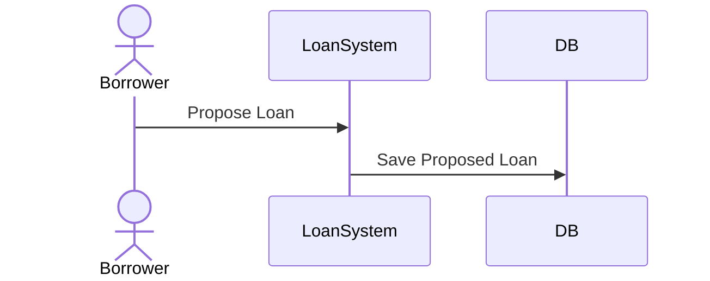
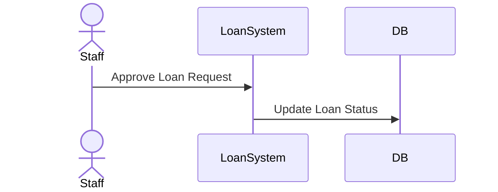
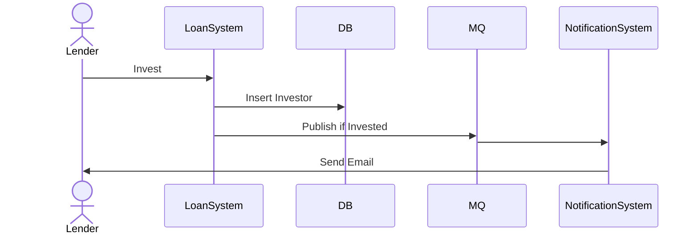
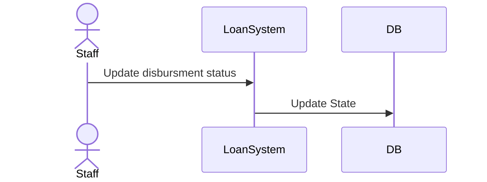

# Loan Service

## Create Loans
Flow when borrower propose the loans to system


## Approve Loan
Flow when the staff approve the loan request




## Invest Loan
Flow when the lender invest the amount of money into some loans.
If the total investment already == principal, publish the loanID into some MQ and notification service will responsible to email the lender


## Disburse Loan
Change loan status into disburse when the money already disbursed to borrower




# API List
```
loanGroup := e.Group("loan")
loanGroup.POST("/loans", a.CreateLoan)
loanGroup.PUT("/loans/:id/approve", a.ApproveLoan)
loanGroup.POST("/loans/:id/invest", a.RecordLoanInvestment)
loanGroup.PUT("/loans/:id/disburse", a.RecordLoanDisbursement)
// TODO: Create API To get loan detail
loanGroup.GET("/loans/:id", nil)
loanGroup.GET("/loans", nil)
```

# Improvement
* [Technical] The code is still draft of API
* [Technical] Can improve the API docs by providing swagger / openAPI
* [Technical] Can improve the code by using unitest
* [Technical] Can improve overall flow by using CI/CD
* [Technical] Can add API to GET the detail
* [Technical] Can implement Auth for security
* [Business] Can add flow to reject the loans
* [Business] Can add detail of the loans tenure
* [Business] Can add flow when borrower failed to pay the loan


